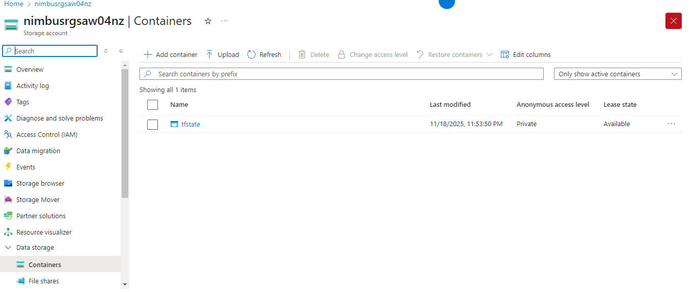
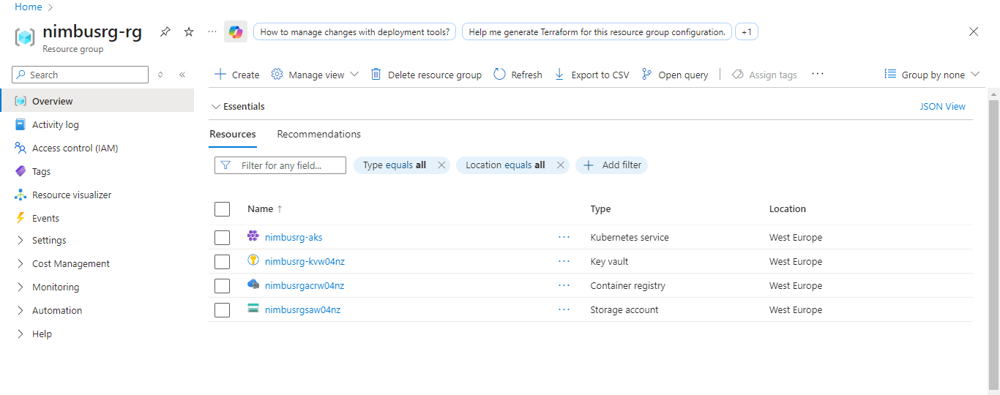

<!-- HEADER -->
<h1 align="center">🌩️ Nimbus Terraform Infrastructure – Azure IaC Deployment</h1> 
 A full production-style cloud environment built with <strong>Terraform</strong> on <strong>Microsoft Azure</strong>.  This project showcases DevOps Infrastructure-as-Code, secure automation, RBAC, and remote state management. 

🚀 Project Overview

 <b>Terraform + Azure = Fully Automated Cloud Infrastructure</b>  This project provisions AKS, ACR, Key Vault, Storage Accounts, RBAC permissions, and remote state backend — using clean, modular Terraform. 

🧱 Core Azure Resources Deployed

Azure Kubernetes Service (AKS)

Azure Container Registry (ACR)

Azure Key Vault

Azure Storage Account + Blob Container

Resource Group

Auto-generated AKS components:

VM Scale Set

Load Balancer

Public IP

Nodepool Resources

Managed Identities

Network Security Groups

🔐 RBAC Configuration

Azure roles provisioned automatically through Terraform:

Role	Purpose
AcrPull	Allows AKS to pull container images from ACR
Key Vault Secrets Officer	Enables AKS to access secrets securely

This ensures secure, least-privilege access across the infrastructure.

📦 Terraform Remote State Backend

Terraform state is stored in an Azure Blob Container for:

Multi-engineer collaboration

Versioned state

Disaster recovery

CI/CD readiness

Stable, production-grade IaC

📁 Repository Structure
terraform/
│
├── provider.tf
├── main.tf
├── backend.tf
├── aks.tf
├── acr.tf
├── keyvault.tf
├── storage.tf
├── rbac.tf
├── variables.tf
├── locals.tf
└── output.tf

🔗 View the Terraform Code

  

📸 Deployment Screenshots

Below are the screenshots exactly as they appear in your repo, with your original filenames:

1️⃣ Terraform Apply — Successful Deployment

  

2️⃣ Remote State Stored in Azure Blob Container

  

3️⃣ Storage Account — Containers View

  

4️⃣ Main Azure Resource Group

  

5️⃣ AKS Node Resource Group (Auto-Provisioned Resources)

  

🧠 Skills Demonstrated
Category	Skills
Terraform	Providers, variables, locals, outputs, RBAC, remote state, debugging
Azure Cloud	AKS, ACR, Key Vault, Storage Accounts, VNets, Managed Identities
DevOps	Infrastructure-as-Code, automation, security-first design, reproducible environments
🎯 Project Outcome

This project deploys a secure, modular, production-style cloud environment using best-practice Infrastructure-as-Code.

✔ Automated provisioning
✔ Remote state in Azure
✔ Strong RBAC & security controls
✔ Clean, scalable Terraform structure
✔ Real-world DevOps execution